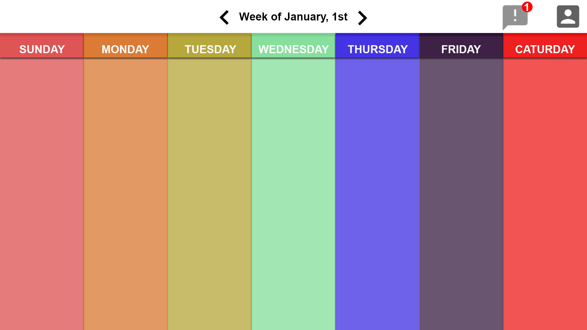
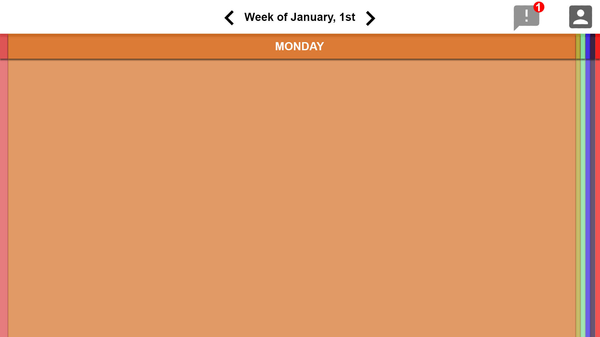

# WorkTaskPlannerPT
CPSC349 MidSemster Prototype, Work Task Planner, look at your weekly tasks, make more tasks, plan ahead, see your weekly progress and productivity

>Assets: should contain images or UI assets
>Scripts: Javascript code
>Styles: Custom CSS files

For the prototype, we planned this as our first screen post login

This mockup shows what happens when you tap a day to "drill into" more details

Using: Bootstrap, Jquery, Popper, Font Awesome (icons), Moment.js